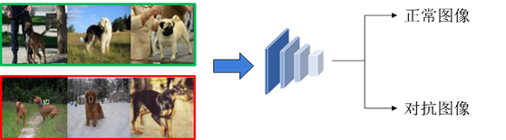
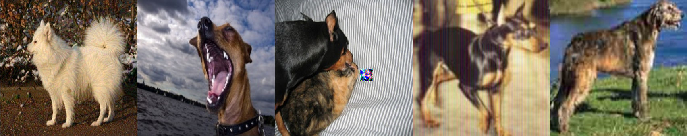
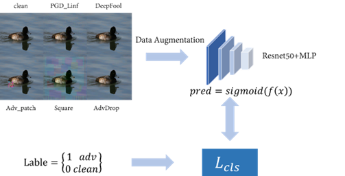
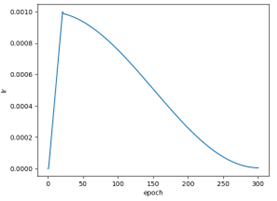

### **一、**    **赛题分析** (Competition Analysis)

本次CVPR 2022 Art Of Robustness Workshop-Robust Models towards Open-world Classification中，我们团队参加的是Track2: Open Set Defense，通过在已有本地数据集上构建不同类别对抗样本用于训练有效的分类器，区分不同类型的对抗样本与正常样本（二分类问题）。

​                               

<b>图1 赛题分析</b>

根据官方的在Phase I, Phase II 阶段的测试集大致可以估计赛题中对抗样本类型，其中包括：Linf(PGD[1])、L2(PGD[1]/Deepfool[2]/CW[3])、AdvPatch[4]、Square[5]、AdvDrop[6]等。

​         

<b>图2 对抗样本分类图，从左到右分别是Linf、L2、AdvPatch、Square、AdvDrop</b>

根据官方的评分机制，我们在初赛和复赛阶段对整体数据集中对抗样本数量统计，其中Phase I的第一部分22000数据中有1450+对抗样本，第二部分5000数据中有370+对抗样本，Phase II的10000数据中有大约980+对抗样本。

在参与整个比赛过程中，我们将赛题难点总结为以下几点：(1)Open Set，在未知的数据上区分正常与对抗样本，这也就意味着分类器要学习到对抗样本数据特征与正常样本数据特征并区分开来；(2)干扰强度较小的L2攻击（DeepFool, PGD），AdvDrop等难以检测；(3)干扰强度的选择，虽然同一类对抗样本在不同攻击强度下的特征是存在相似之处的，但对于数据固定的测试集，不同程度的攻击对训练的分类器影响是较为明显，最后也是参考[RobustART](http://robust.art/)中部分干扰强度。

### **二、**     **解决方案** (Approach)

1. 总体方案框架

我们的方案在Phase I和Phase II的框架大致相同，都是二分类任务框架，不同的是在第二阶段我们修改部分训练数据集，以及参考Domain generalization（DG）尝试设计新的方法，但最后效果不如二分类任务，所以后期并未采用此方案。

本文方案框架如图所示：

 

<b>图3 方案框架图</b>

- **构建数据集**：我们在Phase I第一阶段的训练集上训练正常的分类的Resnet50[7]作为白盒模型，通过攻击算法生成原始训练集对应的对抗样本，包括PGD Linf、PGD L2、DeepFool、AdvPatch、Square等，图像大小为224x224x3。由于是Open Set的任务并考虑训练时间，在Phase II阶段没有选择新发放训练集，但将Phase I第一阶段的测试集与伪标签加入训练中（训练过程仅采用部分对抗数据），最优方案中训练数据由Clean 22k，PGD Linf 11k，DeepFool 11k，AdvPatch 11k，Square 11k, AdvDrop 11k以及Phase I第一阶段的测试集组成，验证集选择Phase I第二阶段的测试集5k张图片。
- 模型结构：考虑到官方模型提交有参数大小和flops限制，我们最终选择Resnet50网络结构，参考文献[8]中MLP在上游任务训练基础上更适合open set的下游任务，于是在fc层中增加一层全连接层，具体参数见代码，经实验验证，该方式的确要比单层分数高。除了此种模型结构，我们参考Domain generalization相关方法，设计Double Head结构，一个在用于动物种类分类，另一个用于对抗样本分类，最终分数与二分类接近，但后期时间精力有限没有进一步深入研究，个人感觉这个思路更适合此赛道。
- **训练方法：**图像预处理，选择基本的flip/rotate/center crop增强，未采用Normalize（消融实验中具体分析），采用Prob=0.2的MixUp；损失函数和优化器选择：交叉熵损失，Optimizer选择AdamW，lr设置为1e-3，scheduler选择CosineLRScheduler，前30 epoch 采用Warmup，min_lr设置为1e-6，batch_size 等于256，epochs等于300，训练过程学习率变化情况如图4所示：

​                                                          

<b>图4 学习率变化</b>

训练过程中设置模型保存阈值，若当前模型在测试集上F1超过阈值则保存。

2. 实现细节

- 复现流程

**1)**  **数据准备：**

提交的文件中没有训练样本，若需要训练将Phase I阶段的训练集放入dataset/clean/目录下，Phase I阶段test1图片放入dataset/track2_test1/目录，test2图片放入dataset/track2_test2/目录下。

**2)**  **生成样本：**

在正常样本上训练的Resnet50生成对抗样本，利用torchattacks库生成，在根目录下执行sh gen_adv.sh，执行结束后在dataset/adv/下生成对应的对抗数据，同时在train_data/adv/下生成训练数据格式文件。

**3)**  **训练：**

在完成步骤2后之后，执行sh train.sh，可修改GPU块号，训练结束后在model_data/目录下查看训练权重与日志文件。

- 参数设置

部分参数设置已在训练方法中说明，其他见代码中config.py。

- 环境配置

| 操作系统     | Ubuntu 20.04.2 LTS       |
| ------------ | ------------------------ |
| 操作系统内核 | 5.4.0-110-generic x86_64 |
| Python       | 3.7.10                   |
| GPU          | GeForce RTX 2080ti       |

其余Python依赖包见requirements.txt。

### **三、**    **消融实验** (Ablation Study)

1. 实验分析

考虑到Normalize可能会对对抗样本的特征有影响，本方案未采用Normalize，后经实验验证未使用方案分数高于使用方案；通过观察测试集数据，发现其中正常样本与对抗样本均存在模糊，亮度，灰度以及颜色通道等变化，于是我们也尝试在图像预处理阶段添加Blur & Gray & HueSaturationValue & BrightnessContrast（BGHB）， 但经实验验证添加BGHB后验证分数且提交得分不如未添加BGHB。同时我们也尝试过Label Smoothing来提高模型泛化性，但效果也不好；MixUp有一定的提升效果，具体对比见下面消融实验结果。

2. 消融实验设置

数据处理消融实验中模型结构、测试集、训练策略保持不变，考虑训练集预处理过程中normalize（N）, Blur&Gray&HueSaturationValue&RandomBrightness-Contrast(BGHB)、MixUp（M）、Label Smoothing（LS）对方案的影响。F1-score作为评价指标。最优方案为M + w/o N + w/o BGHB + w/o LS（Best）。

表1 数据处理消融实验

|  Model+Dataset  | Metric    | Best   | N      | BGHB   | w/o M  |   LS   |
| :-------------: | --------- | ------ | ------ | ------ | ------ | :----: |
| Resnet50 +BeseD | Accuracy  | 0.9932 | 0.9893 | 0.9876 | 0.9874 | 0.9858 |
|                 | Precision | 0.9619 | 0.9589 | 0.9331 | 0.9379 | 0.9364 |
|                 | Recall    | 0.9464 | 0.8930 | 0.8981 | 0.8901 | 0.8686 |
|                 | F1        | 0.9541 | 0.9252 | 0.9153 | 0.9133 | 0.9013 |

基本训练集包括Clean、PGD_Linf、Adv_Patch、Adv_Square和Test（总体简称为BaseD），DeepFool和Adv_Drop虽然出现在官方测试集中，但是同等条件下在BaseD数据上的训练的分类器提交的分数要高于BestD + Deepfool + Adv_Drop训练的分类器（但是后者在本地的验证集上的性能要更好），实验结果见表2。

表2 训练集组成消融实验

| Model    | Metric    | BaseD  | Deepfool | Adv_Drop | DeepFool+Adv_Drop |
| -------- | --------- | ------ | -------- | -------- | ----------------- |
| Resnet50 | Accuracy  | 0.9932 |          | 0.9906   |                   |
|          | Precision | 0.9619 |          | 0.9358   |                   |
|          | Recall    | 0.9464 |          | 0.9383   |                   |
|          | F1        | 0.9541 |          | 0.9371   |                   |

#### **四、**    **参考文献** **(**Reference**)**

1.  Aleksander Madry, Aleksandar Makelov, Ludwig Schmidt, Dimitris Tsipras, Adrian Vladu. Towards Deep Learning Models Resistant to Adversarial Attacks. ICLR 2018. 
2.  Seyed-Mohsen Moosavi-Dezfooli, Alhussein Fawzi, Pascal Frossard. Deepfool: a simple and accurate method to fool deep neural networks. CVPR 2016.
3.  Nicholas Carlini, David A. Wagner. Towards evaluating the robustness of neural networks. IEEE Symposium on Security and Privacy 2017.
4. Tom B. Brown, Dandelion Mané, Aurko Roy, Martín Abadi, Justin Gilmer., et al. Adversarial patch. arXiv preprint arXiv:1712.09665, 2017.
5.  Maksym Andriushchenko, Francesco Croce, Nicolas Flammarion, Matthias Hein. Square attack: a query-efficient black-box adversarial attack via random search. ECCV 2020.
6. Ranjie Duan, Yuefeng Chen, Dantong Niu, Yun Yang, A. Kai Qin, Yuan He. AdvDrop: Adversarial Attack to DNNs by Dropping Information. ICCV 2021.
7. Kaiming He, Xiangyu Zhang, Shaoqing Ren, Jian Sun. Deep Residual Learning for Image Recognition. CVPR 2016.
8.  Yizhou Wang, Shixiang Tang, Feng Zhu, Lei Bai, Rui Zhao, Donglian Qi, Wanli Ouyang. Revisiting the Transferability of Supervised Pretraining: an MLP Perspective[J]. arXiv preprint arXiv:2112.00496, 2021.
