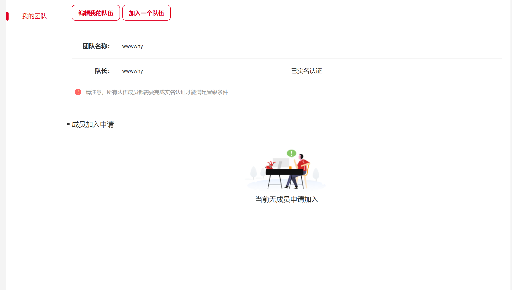
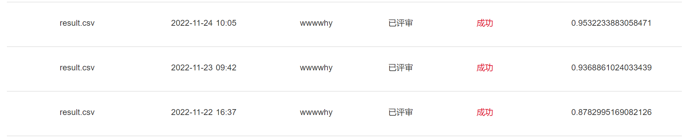

## 江苏大数据-医疗赛道（胃癌分类）

从建模算力及环境，算法思路（数据、模型、训练）等方向描述：

### 一、建模算力及环境

| Name         | Version                  |
| ------------ | ------------------------ |
| 操作系统     | Ubuntu 18.04.6 LTS       |
| 操作系统内核 | 5.4.0-125-generic x86_64 |
| Python       | 3.7.12                   |
| GPU          | 2*GeForce RTX 3090       |

其余Python依赖包见requirements.txt。

### 二、算法思路

#### 2.1 数据

- Train Data

​	本次比赛将胃癌数据分成T0, T1, T2, T3, Tis等五类,其中T0是正常，其余几种是有癌症。官方公开的数据集时kfb格式的大图片，T0无标注json文件，T1,T2,T3,Tis等不完全有json文件，其中T1,T2,Tis是在scale为40的条件下标注的，T3是在scale=20下标注。

​	目前采取的数据处理方式为：

1. 训练集不考虑json文件标注位置，切割图片大小直接保存（根据CV2的自适应阈值，尽可能保留主体部位），具体见中train/save.py文件
2. 参考json文件中点位置，通过cv2.fillPoly()方法生成MASK图像用于分割，但训练反馈效果不是很好，遂使用上面处理方式

- Test Data

  参考json文件先分割成JPG图片然后通过pth保存为{name_annotationX* : tensor}的格式，用于inference.

​	训练和测试数据都分割成1000x1000x3的图像，一方面减少大量冗余图像，另一方面尽可能保留整体病灶位置图像

#### 2.2 模型

尝试Swin_T，Swin_B，Convnext_T，Convenext_B，Efficientnet_B3~B5等系列模型，通过timm.creat_model构建（指定超参数），最终Efficientnet_B5表现最好（目前选用）

#### 2.3 训练策略

​	模型性能优化：

- ​	图像预处理：RandomResizeCrop、Flip、ColorJitter、Rotation等，Inputsize分别选过224，384，512但是效果并不好，最终选择224。Normalize以Layer方式使用。

  ``

  ```python
  class NormalizeLayer(torch.nn.Module):
      def __init__(self, means, sds):
          super(NormalizeLayer, self).__init__()
          self.means = torch.tensor(means)
          self.sds = torch.tensor(sds)
      def forward(self, input: torch.tensor):
          (batch_size, num_channels, height, width) = input.shape
          device = input.device
          means = self.means.repeat((batch_size, height, width, 1)).permute(0, 3, 1, 2).to(device)
          sds = self.sds.repeat((batch_size, height, width, 1)).permute(0, 3, 1, 2).to(device)
          return (input - means) / sds
  ```

- ​	其他数据增强：Mixup，CutMix均未提升分数，CutOut有点点效果，可能是因为本赛题待分类样本的整体color,shape上过于接近，mix的不适合

- ​	标签处理：LabelSmoothing(提升)

- ​	其他策略：AdvTrain(提升不明显，但过于费时)

  ```python
  if self.args['adv_train']:
  	if epoch >= self.args['warmup_epochs']:
          self.model.eval()
          attack = torchattacks.__dict__[args['attack_method']](model=self.model, 				**args['attack_method_params'])
          adv_image = attack(inputs, labels)
          self.model.train()
          with autocast():
              adv_outputs = self.model(adv_image.cuda())
              adv_loss = F.cross_entropy(adv_outputs, labels)
              loss += adv_loss
  ```

- ​	待尝试策略：AWP...

​	训练速率优化：

- ​	混合精度训练
- ​	梯度积累backward


### 三、 算法运行

首先在根目录下，构建Python虚拟环境，然后参考requirements.txt 下载所需python package。然后将训练数据放入raw_data/train目录下，测试数据放入raw_data/test目录下，

目录中格式为：

 |-- raw_data

​		|-- train

​			 |-- T0

​             	|-- kfb

​             	|-- json

​			  .....	

​		|-- test

​			     |-- kfb

​             	|-- json

​				 |-- annotation.csv

#### 3.1 训练过程

```sh
# 根目录进入训练目录
cd train
# 处理训练数据,处理完成后对应图片保存在raw_data/train/T*/images,该sh多进程同时处理
# 数据处理仅需执行一次即可
sh traindata2jpg.sh
# 执行训练，可指定cuda,调整其他训练参数(batch_size,input_size,...)请修改config.py文件
sh run.sh
# 训练完成后，模型保存至model/backbone_name/model.pth,供推理使用
```

#### 3.2 推理过程

```sh
# 根目录进入推理目录
cd code
# 处理测试数据,处理完成后对应图片保存在raw_data/test/images/name_annotation*/,并通过pth保存为dict{'name_annotation*':tensor}的格式,该dict保存至temp_data
# 可修改data2tensor.sh中第二行执行命令中input_size大小、读入、保存路径
# 数据处理仅需执行一次即可
sh data2tensor.sh
# 执行训练，可修改sh指定cuda，batch_size,input_size大小（与上面保持一致）
sh run.sh 
# 执行完，结果保存至result/result.csv
```

### 四、 队伍信息

单人组队：wwwwhy



王浩宇，230506199904020418

提交记录：



