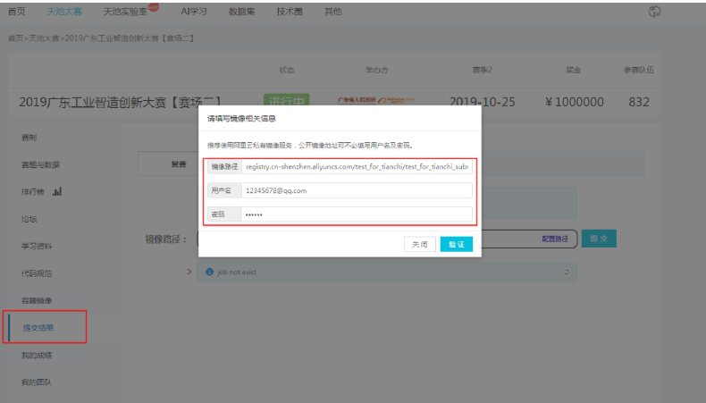
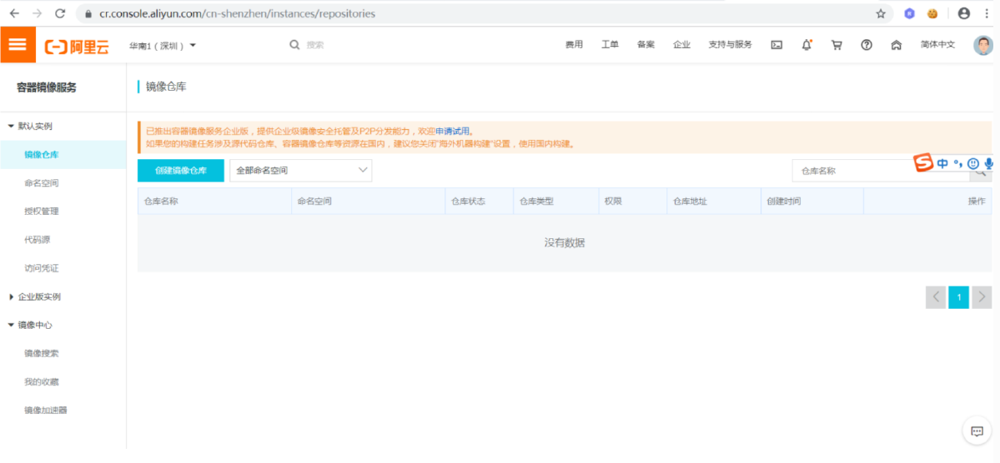
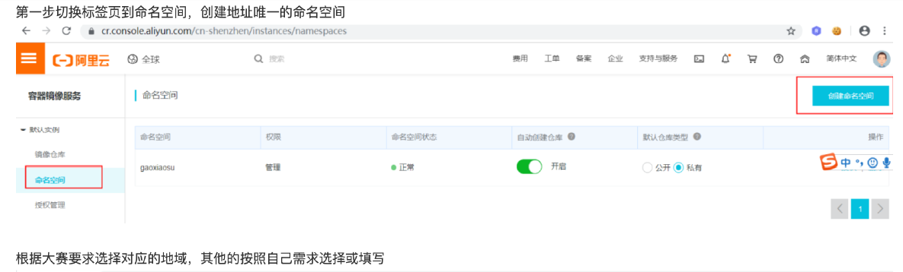
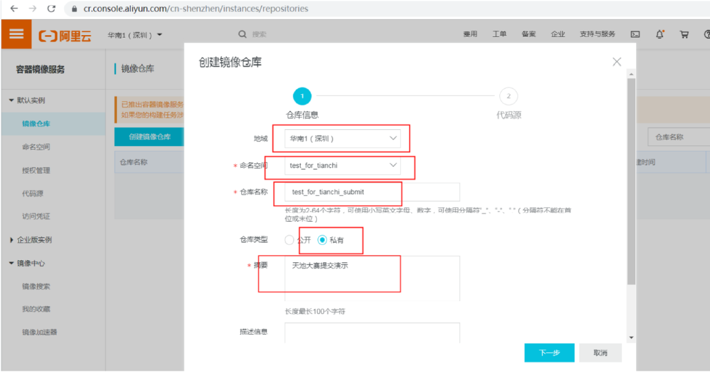
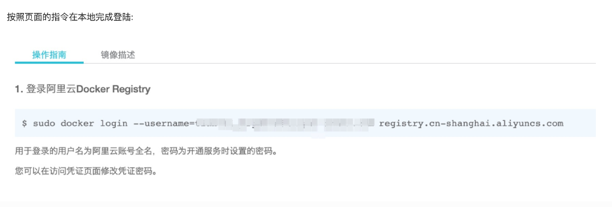
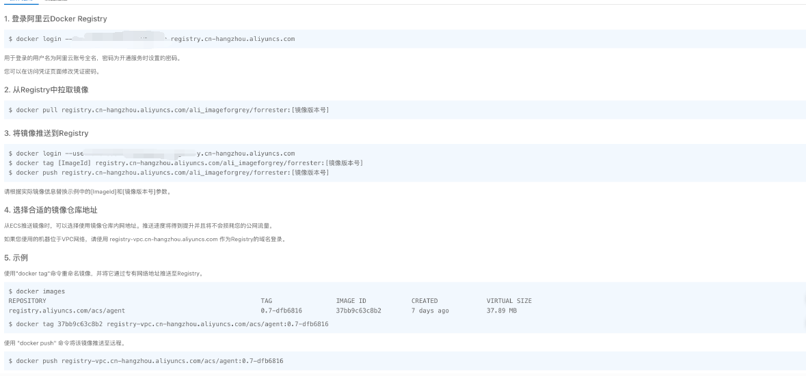
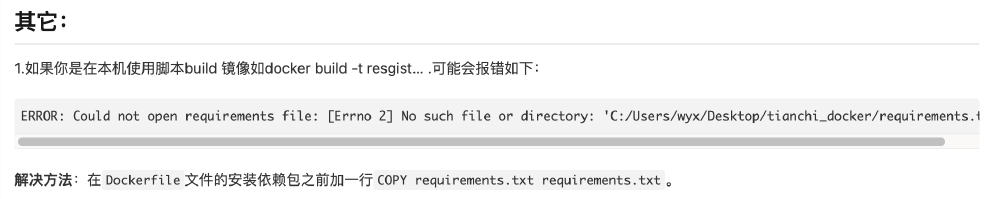

# 天池——docker

### 1.创建阿里云容器镜像

(dockerhub其实也行，天池的比赛应该只能用阿里云，这样也方便)、

这个图是别的比赛的提交方式




**注册地址：https://cr.console.aliyun.com**

#### 1.1 注册开通










####  **我创建完就是这种界面，我感觉就是类似于推到了github**



### 2.安装docker

安装docker我觉得官方文档靠谱点，不会出错

```bash
sudo apt install docker.io
```

### 3.启动GPU版本Docker

这个我没试过，我的服务器本身就是个容器，这个还是要测试一下

```bash
# Add the package repositories distribution=$(. /etc/os-release;echo $ID$VERSION_ID) curl -s -L [https://nvidia.github.io/nvidia-docker/gpgkey](https://nvidia.github.io/nvidia-docker/gpgkey) | sudo apt-key add - curl -s -L [https://nvidia.github.io/nvidia-docker/$distribution/nvidia-docker.list](https://nvidia.github.io/nvidia-docker/$distribution/nvidia-docker.list) | sudo tee /etc/apt/sources.list.d/nvidia-docker.list sudo apt-get update && sudo apt-get install -y nvidia-container-toolkit sudo systemctl restart docker
```

### 4.测试docker

```bash
docker run hello-world
```

### 5.使用Dockerfile构建镜像

```dockerfile
# Base Images 可以指定版本
## 例如：pytorch/pytorch:1.11.0-cuda11.3-cudnn8-devel
FROM pytorch/pytorch

## 安装依赖包 也可以替换成单独的包安装 据说用requirement安装有可能找不到路径
RUN pip install -r requirement.txt

## 把当前文件夹里的文件构建到镜像的根目录下，并设置为默认工作目录
# workspace可以替换
# ADD . /
# WORKDIR /
ADD . /workspace
WORKDIR /workspace

## 镜像启动后统一执行 sh run.sh
CMD ["sh","run.sh"]
```

### 6.构建镜像

```bash
docker build [选项] <上下文路径/URL/->
docker build -t registry.cn-hangzhou.aliyuncs.com/[命名空间]/[仓库名称]:[镜像版本号] .
docker build -t registry.cn-hangzhou.aliyuncs.com/ali_imageforgrey/forrester:1.0 .
```

注意：`registry.~~~`是上面创建仓库的公网地址，用**自己仓库地址替换**。地址后面的`：1.0`为自己指定的版本号，用于区分每次build的镜像。最后的`.`是构建镜像的路径，不可以省掉。

### 7.GPU镜像

构建完镜像可以先验证是否正常，再推送

**CPU**镜像：`docker run your_image sh run.sh`
**GPU**镜像：`nvidia-docker run your_image sh run.sh`

### 8.推到远程仓库

```bash
docker push registry.cn-hangzhou.aliyuncs.com/[命名空间]/[仓库名称]:[镜像版本号]
```

### 9.测试

构建完可以测试验证，正常后再推送，**这个我没测试**

```bash
docker run --gpu all registry.cn-hangzhou.aliyuncs.com/[命名空间]/[仓库名称]:[镜像版本号]
```

如果内存限制，不够用：

```bash
docker run --shm-size 8G --gpu all registry.cn-hangzhou.aliyuncs.com/[命名空间]/[仓库名称]:[镜像版本号]
```




