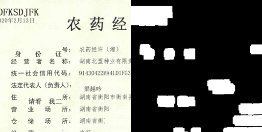
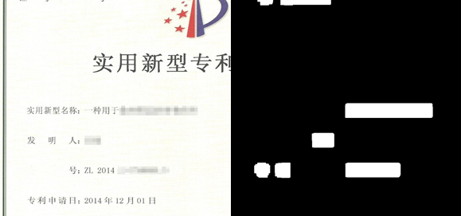
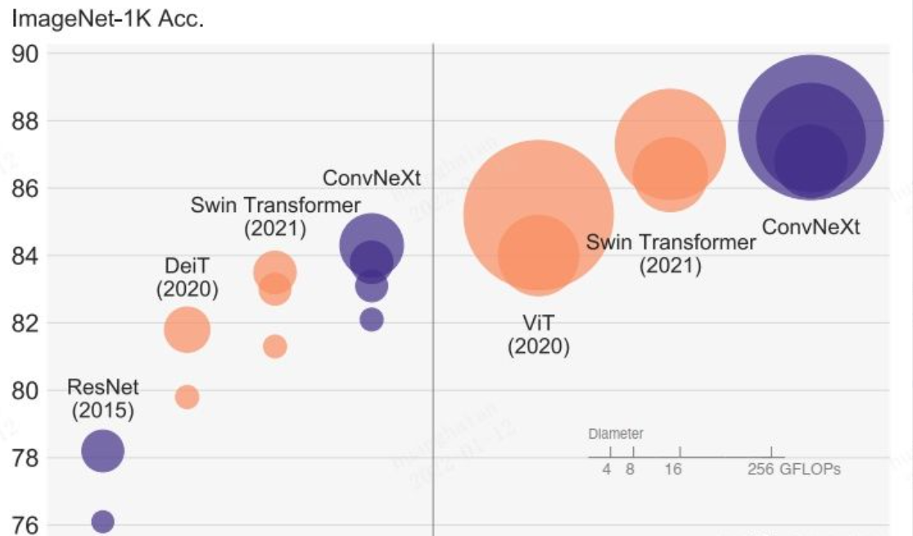

## 天池比赛-真实场景篡改图像检测挑战赛

### 一、 赛题解读

赛题为检测并定位图像中的篡改痕迹，图像中的篡改类型分为马赛克、copy-move、remove、splcing等。鉴于本题仅将所有的篡改类型归为一类，最终只输出关于篡改区域的mask，因此我们将本题简单定义为一个对像素的二分类问题，我们将本题当作语义分割问题来做。

​																		图一、Copy_move，擦除篡改

​																			图二、马赛克，擦除篡改

### 二、方案

#### 训练相关

参考上次比赛相关讨论，由于是第一次做此类型比赛，就延续使用上次比赛参赛团队的方法以及开源Baseline，我们的使用model训练的框架是在去年Rank3的团队代码上修改的。

实验上分记录：

1. 框架本身采用的是unet+seresnext50+scse，我们最开始也是延续使用这样的backbone，在512X512的训练尺度上训练，loss函数是bce loss，optimizer=adam，分数只有1600+。
2. 在计算资源满足的条件下我们更换了更大的backbone：senet154，训练策略与1相同，分数有提高，大概能到1800左右。
3. 开始探索不同的优化器和损失函数搭配，最终方案优化器使用Adamw+余弦退火+warmrestart，损失使用BCE+Dice按系数(0.7、0.3)混合搭配，在原始数据集上达到2000分左右。
4. 我们团队尝试了对训练测试图像分割，最开始分割成512X512的图像训练，然后再正常数据集上测试，提升效果不明明显，然后在分割成512X512的图像上推理，推理完再将mask融合成原来大小，分数提升至2400+，然后我们分别尝试了768分解，896分解分数都有提升，2500+，2600+等等。不过在我们后期测试过程中发现，分割训练集对最后的结果影响不大。同时我们考虑将上次比赛的数据作为附加训练集，效果有小幅度提升。
5. 再根据每次训练的log可以看到，在训练后期本地划分的验证集测试结果中dice loss下降明显，但是对最后的得分影响不大，而bce影响到时有的，所以我们就添加了focal loss，来进一步平衡正负样本（虽然不知道用的合不合理....）（bce,dice,focal权重0.7:0.3:1）
6. 后期我们又将目光转到数据上，我们对数据集做了大量的探索，包括制作额外的篡改数据集，对数据集进行分层抽样，去除训练集图片当中标注明显错误的图片、离线数据增强、复杂数据增强等等，但效果都不显著，基本没有提升。根据test推理结果看出，model对图书类，截图效果不好，我们就自行做了一部分数据集，提升效果不明显。
7. 最后的训练策略：根据未分割数据集，768分割数据集，上次比赛数据以及自行制作的一部分数据构建不同分布数据集训练多个model；model 选择Unet+senet154+scse；采用adamw+余弦退火+warmrestart；loss选择bce+dice+focal。根据训练集不同训练5个model，单model分割结果能到2750+。

#### 推理过程

##### Inference

推理过程分为以下4步：

1. decompose：将test目录下的图像数据分割成最大为896X896的图像，临时保存至user_data/decompose目录下（具体分割方法见test/utils.py 中decompose）
2. load_model&inference：模型加载user_data/model_data中五个不同权重，每加载完一个权重推理整个分割数据集，保存至user_data/tmp_test下，其保存文件夹名与model权重文件夹名称相同。
3. merge：步骤2中推理的结果也是分割开的，在推理完分割数据后通过merge将分割图像融合
4. vote：上面3个步骤完成后就会生成五个model的推理结果，通过投票机制，对于一个像素点投票数>=3就将其标记为mask，最终投票结果保存至prediction_result中。

#### 复赛阶段

由于复赛阶段一时想不到什么上分策略了，就在已训练好的方案上为finetune，分数也是不升反降.....最终排名15。

### 三、复盘总结

参考rank1和rank5的大佬，再反观自己的方法，感觉在每一步上都差了，那么在一些方法上继续推进就跑过去试其他的方。第一次尝试图像分割类比赛，经验还是很欠缺的，学到就是赚到。

1. 模型选择对比：前排大佬几乎都采用了mmseg这个框架，今天去了解了一下，这个框架融合了很多现有的方法，更换method，backbone就只需要修改config即可，可谓是比赛一大利器。至于backbone的选择，大佬们也都选择了较大的model ——ConvNeXt和Swin transformer等等，这两个霸榜的model还是看来还是可以霸榜cv其他子领域的。从结果来看ConvNeXt 和 Swin 单model分割都能到3000+（我们最高才2770....）

   

2. 数据选择对比（增强手段）：

   - 参考这两个方案好像并没有对训练图像进行分割，都是在原有数据以及安全挑战者第五期数据resize后 然后再crop（增加图像局部特征信息），两个团队分别都对数据随机resize(radio = 1~3)，然后crop 到768或者1024训练。
   - 复赛阶段都将初赛的测试集及伪标签加入到了训练过程中，对于如何选择测试集中数据（第一名是选取了其>0.7为前景，<0.5为背景，中间不确定部分为ignore index），这个ignore是我们当时没有考虑到的（其实不知道这个是干嘛的哈哈哈）

3. loss选择对比：我们在比赛过程中也考虑到了正负样本不均衡问题，就加入了focal loss（第一次用，不知道用的对与否），而两团队都采用了lovasz-loss(据说这是kaggle一个神器)，自动平衡训练过程中样本权重，保证对每张图片的正样本都有足够的学习能力。

4. 训练过程对比：两团队都采用了预训练过程，都是逐步训练

   1. rank1方案：采用渐进式学习方式。首先利用768×768 输入训练模型，然后利用 1024×1024 输入进行模型微调。同样在数据方面，先仅利用 40k 训练集进行模型训练，然后加入扩充样本进行模型微调。伪标签交叉监督CNN 和 Transformer 结构的网络，提升模型效果。
   2. rank5方案：对初赛4k张做伪标签，然后和4k训练集一起，8k张预训练模型，为啥只预训练(参考https://mp.weixin.qq.com/s/PaRbW7LCJdciJke3YU6GUg)，完事儿再用4k真实标注finetune。

5. 推理过程对比：rank1团队通过mmseg的slide推理模式（具体是什么还是要了解一下mmseg这个框架），rank5团队采用了大尺度推理（甚至达到到了1536推理，我们团队最高得分是在869，没有试过1024或者更高)。

##### 最后附上：

##### Rank 1经验分享：https://github.com/CarnoZhao/mmsegmentation/tree/tianchi_tamper

##### Rank 5经验分享：https://mp.weixin.qq.com/s/zsKE1sz8gqtzmwsP4CZGkg

